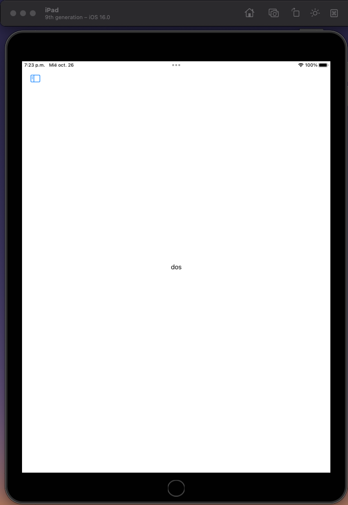
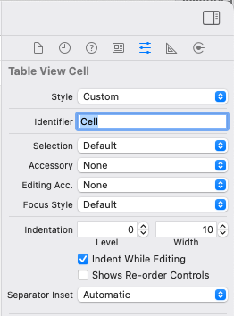

---
hide:
  - navigation
---

# 3- Aplicaciones universales 

En esta primera parte empezaremos explicando cómo programar una app universal cuya interfaz se adapte a modelos y tamaños diferentes de iPhone y iPad teniendo en cuenta si las vistas son compactas o regulares. A continuación haremos un ejercicio usando el componente _Split View_ y adaptando las vistas a distintos dispositivos. 

## Diseño de apps universales en XCode

En este apartado veremos qué son las aplicaciones universales, qué ventajas e inconvenientes podemos encontrar a la hora de diseñarlas, cómo programarlas, y las recomendaciones de Apple para adaptar las vistas. 

### Introducción

Normalmente se usa el término **universal** para denominar a todas aquellas aplicaciones adaptadas tanto al iPad como al iPhone. Los usuarios agradecen este tipo de aplicaciones ya que pueden usarlas en todos sus dispositivos. Además, cuanto más dispositivos compatibles tengamos más clientes potenciales podremos captar.

El desarrollo de una aplicación universal ahorra tiempo   respecto a implementar apps independientes para cada dispositivo, ya que evidentemente programaremos el código en un sólo proyecto en lugar de varios. También tiene ventajas para las actualizaciones, ya que tendremos que preocuparnos de implementar los cambios sólo en una aplicación.

### Diseñando la interfaz de una aplicación universal

El primer paso para hacer una aplicación universal es tener en cuenta el diseño del interfaz para cada una de las vistas. En versiones anteriores de iOS se separaban las vistas de iPhone de las de iPad usando distintos ficheros _.xib_. Actualmente se debe hacer de forma conjunta usando los _storyboards_ y _autolayout_ en el caso de `UIKit` (que es la que estamos viendo en la asignatura), o bien directamente mediante `SwiftUI` en las últimas versiones.

Estos son algunos de los aspectos principales que debemos tener en cuenta para diseñar una interfaz universal:

* **Orientación.** Con la información sobre la orientación del dispositivo podremos adaptar la interfaz para acomodarla al mismo.  
* **Estructura de las vistas**. La pantalla del iPad es más grande que la del iPhone, permitiendo al usuario acceder a más información en pantalla.
* **Comportamiento de las API.** Componentes como los `UIPopover`, por ejemplo, se comportan de forma distinta en un iPhone y en un iPad.
* **Características Hardware.** Los dispositivos iOS pueden tener distintas funcionalidades hardware, como el número de cámaras, la capacidad de gestionar _dynamic islands_, soporte para _Pencil_, etc., que hay que tener en cuenta cuando se implementa una aplicación universal.
* **Gestos.** En la pantalla del iPad a veces podemos realizar más gestos que en la del iPhone debido a su tamaño. Por ejemplo, se pueden usar cuatro dedos al mismo tiempo.
* **Arte.** Hay que tener en cuenta la resolución de los distintos dispositivos, almacenando las imágenes en los _Assets_ usando  varias resoluciones. Una alternativa recomendada por Apple es usar archivos PDF en los Assets. 

Como acabamos de ver, para programar una aplicación universal en iOS debemos tener en cuenta las características del dispositivo. Para esto podemos usar código condicional. Por ejemplo, podemos detectar en cualquier momento si estamos ejecutando nuestra app con un iPhone o un iPad con la instrucción `UIDevice.currentDevice().userInterfaceIdiom` o su modelo con `UIDevice.currentDevice().model`.

### Programando una aplicación universal

Vamos a implementar un ejemplo de app universal paso a paso.

<!---
Si nombramos los ficheros de las vistas con el sufijo `~ipad` o `~iphone` (por ejemplo `MyViewController~ipad.xib` y `MyViewController~iphone.xib`), el compilador llama automáticamente a la vista del dispositivo correspondiente.
--->

<!---
A pesar de las recomendaciones de Apple, usar _xib_ para las vistas tiene ciertas ventajas, como la reutilización de código y la posibilidad de editar proyectos de forma compartida, que con el _storyboard_ se complica. Ya hemos visto en apartados anteriores cómo usar _xibs_, y a continuación veremos cómo hacer una aplicación universal con _storyboards_.
--->

Comenzamos abriendo _XCode_ y creando un nuevo proyecto de tipo `iOS > App` al que llamaremos `ejercicio_peliculas` Abrimos la vista principal del _storyboard_. 

* Arrastra un `UILabel` a la vista principal del _storyboard_ y suéltala por el centro de la vista.
* Podemos ver cómo quedaría en distintos dispositivos sin llegar a ejecutar el simulador. En el _storyboard_ pincha en la parte inferior, donde aparece el modelo (por ejemplo, iPhone14).
 y elige otro modelo, por ejemplo un iPad.
* La etiqueta se desplazará a otro lugar. Si rotamos el dispositivo (en la parte inferior, con el icono de un cuadrado que tiene encima una flecha), es posible que hasta desaparezca de la pantalla. 
* Ajusta las opciones de _autolayout_ para la etiqueta. Si no controlas todavía _autolayout_, puedes seleccionar el triángulo de la parte inferior  (_Resolve autolayout issues_) y elegir _Reset to suggested constraints_.
* Si mueves el `UILabel` a otra posición, verás que las líneas azules de guía aparecen ahora de color naranja. Esto es porque todavía tenemos las _constraints_ anteriores y son inconsistentes con la nueva posición. Para actualizar la vista pincha de nuevo en el triángulo y selecciona _Update constraint constants_.

Puedes ampliar o reducir los _previews_ haciendo zoom con los dedos en el _trackpad_, o usando los controles de la parte inferior.

En principio es sencillo, aunque a veces es complicado saber cómo ajustar las _constraints_ y manejar _autolayout_. Las opciones de _autolayout_ pueden parecer fáciles de interpretar, pero a la hora de la verdad no es fácil dejar una vista como queremos.

## Vistas dependientes del dispositivo

A veces interesa tener vistas diferentes para distintos tamaños para aprovechar mejor la pantalla. Como se ha mencionado anteriormente, se recomienda usar interfaces diferenciados, ya que simplemente escalar el tamaño de los componentes para pantallas más grandes no suele quedar bien.

Para el diseño del interfaz, en lugar de distinguir entre iPhone e iPad, Apple introdujo en XCode 7 el concepto de _size clases_. La idea es que el desarrollador piense el diseño sólo para dos tamaños:

* **Compact**: Cuando tenemos un tamaño _Compact_ debemos hacer un interfaz mínimo que muestre sólo la información más relevante de forma compacta.
* **Regular**: En un tamaño _Regular_ podemos añadir más elementos y hacer un interfaz completo, ya que dispondremos de más espacio en la pantalla.

Además, estos tamaños pueden venir dados para la anchura (_Width_) o la altura (_Height_). Por tanto, debemos tener en cuenta tres factores:

* **Dispositivo**. iPhone o iPad.
* **Orientación**. Horizontal o vertical.
* **Tamaño**. Compacto o regular.

Básicamente (aunque en realidad es algo más complicado), los dispositivos de Apple tienen los siguientes tamaños:


En la imagen, el iPhone que se ve en arriba en el centro es un iPhone 6s **plus**. Los modelos más grandes de iPhone tienen un tamaño regular cuando el móvil está apaisado. 

Puedes ver un listado completo de los tamaños al final de [este enlace](https://developer.apple.com/design/human-interface-guidelines/foundations/layout/).


> En realidad es más complicado porque hay que tener en cuenta que **no debemos asumir que los tamaños de vista son siempre constantes**, ya que por ejemplo nuestra app en un iPad podría mostrarse en una zona compacta de la pantalla en lugar de usar la pantalla completa. Por tanto, siempre debemos diseñar todas las vistas tanto en modo compacto como regular. 

En la ventana inferior de _XCode_ podemos cambiar el tipo de dispositivo, su orientación, y en el caso del iPad, su adaptación. Independientemente de lo que seleccionemos, los cambios que hagamos aquí sobre la vista se aplicarán a **todos** los tamaños.

Es posible mostrar un componente (por ejemplo, un botón o una etiqueta) sólo para un tamaño determinado. Para esto, puedes seleccionarlo y pinchar en el símbolo `+` que aparece junto a `Installed` en las propiedades del  componente. 


Si por ejemplo elegimos _width Compact_ y _height Regular_ (`wC hR`) y desmarcamos `Installed`, la etiqueta desaparecerá para estos tamaños (pruébalo y verás que desaparece en un iPhone SE). 

También se pueden cambiar las propiedades de los componentes en función del tamaño actual. Por ejemplo: 

* Selecciona en la barra de abajo un iPhone SE (1st generation) en orientación apaisada (en este caso es `wC-hC`).
* Pulsa sobre el botón `+` a la izquierda de la propiedad _Font_ de la etiqueta, en el _Attributes Inspector_, y luego en _Add variation_, dejando _width=Compact_ y _height=Compact_.
* Fíjate en que aparece una nueva columna en la tabla de propiedades. Puedes cambiar la fuente a 15 puntos, y esto sólo se aplicará en los dispositivos `wC-hC`.
* Como puedes ver, muchas propiedades tienen el botón `+` para hacer cambios sólo con ciertos tamaños. Si quieres eliminar la configuración de una propiedad, puedes pulsar sobre el botón `x` que aparece a su lado.


<!--
## Componentes para iPad

Debido a las diferencias evidentes de tamaño entre un iPhone y un iPad (al menos hasta el lanzamiento del _iPhone 6_), Apple desarrolló una API específica para iPad. La intención era que aquellas aplicaciones para iPad se beneficiaran de esta API para mejorar la experiencia de usuario y la usabilidad. Por ello aparecieron dos nuevos controladores enfocados a esta plataforma:

* **Popover**: Es una ventana emergente que puede aparecer en cualquier parte de la pantalla, normalmente junto a un botón al pulsarlo. Resulta muy útil para mostrar un listado de opciones o una tabla con información sin llegar a ocultar toda la pantalla.
* <a href="https://developer.apple.com/reference/uikit/uisplitviewcontroller">**Split View**</a> (Vista dividida): Está formado por dos vistas independientes, una situada en la parte izquierda y otra en la parte derecha. Se utiliza frecuentemente para mostrar en la izquierda un listado de opciones en forma de tabla, y en la derecha el detalle de lo seleccionado en la parte izquierda. El _Split View_ normalmente se usa en la primera pantalla de la aplicación (como controlador raíz). A pesar de que puede usarse en una vista intermedia no es recomendable hacerlo, y además Apple no permite incrustar este controlador en otro controlador contenedor como un `UINavigationController`. Cuando creamos un nuevo proyecto con la plantilla `Master Detail Application` se genera la estructura básica para una aplicación Universal (por defecto) usando el controlador `UISplitView Controller` como base.


> En versiones anteriores a iOS sólo estaba permitido usar _Split Views_ en iPad. Desde iOS 8.0 y coincidiendo con la aparición de los modelos con pantallas de mayor tamaño, se puede usar _Split Views_ en todos los dispositivos iOS, aunque la vista dividida sólo puede verse en _iPad_, _iPhone plus_ y _iPhone X_.

En este tema veremos cómo implementar _popovers_ y _Split Views_ para hacer apps universales.

## Popovers

### Introducción

Un _popover_ es una ventana secundaria (estilo _popup_) que aparece por encima de la ventana principal de la interfaz. Se puede programar para que desaparezca automáticamente cuando el usuario toca cualquier parte de la pantalla.

El tamaño del _popover_ se puede modificar y por supuesto puede contener casi cualquier vista que se desee, como por ejemplo un listado de opciones de configuración, un álbum de fotos del que el usuario pueda seleccionar una, un formulario simple para introducir un texto, etc. En un iPhone, un _popover_ de iPad puede corresponderse con cualquier vista que ocupe la pantalla completa.
-->
<!---
> Los _popover_ son de los pocos objetos en iOS que no se pueden crear usando el _Interface Builder_ de XCode. Hay que crearlos mediante código.

Si has usado XCode7 o superior para compilar el ejemplo anterior, habrás notado que sale un _warning_ de compilación indicando que `UIPopoverController` está _deprecated_.

> Los métodos y componentes _deprecated_ son aquellos que Apple recomienda no usar, porque de momento funcionan pero en futuras versiones de iOS puede que se cambien o eliminen. Hay métodos y propiedades _deprecated_ como `cell.textColor`, que se puso en este estado en iOS 3.0 pero pudo seguir usándose hasta iOS 9.0.

--->
<!--
En iOS 9 Apple cambió la forma de crear popovers debido a la inclusión de _multitasking_, que permite ejecutar dos aplicaciones simultáneas que comparten la pantalla. Por tanto, en lugar de usarse la antigua clase `UIPopoverController` ahora se utiliza `UIPopoverPresentationController`, que tiene bastantes ventajas respecto a la anterior.

Con el fin de aclarar la definición de _popover_ y ver cómo podemos utilizarlo en nuestras aplicaciones vamos a realizar un sencillo ejercicio para mostrar un _popover_ que contiene un pequeño listado de opciones.

## Ejercicio 1 - Popovers

Creamos un nuevo proyecto de tipo _Single View_ llamado `ejercicio_popover`. Para empezar nos iremos al storyboard y pondremos la vista principal dentro de un `UINavigationController` con _Editor->Embed in->Navigation controller_.

Añadimos un botón (`UIBarButtonItem`) en la parte derecha de nuestra barra de navegación del `View Controller`. Le daremos el título `Opciones`. La idea es que cuando se seleccione este botón aparezca un _popover_ que mostrará una tabla.

Crea una acción llamada `accionOpciones` en `ViewController.swift`, que se active cuando se pulse el botón. De momento dejaremos este método vacío, ya que todavía no tenemos la vista a mostrar.

### Creando el controlador a mostrar

Para la vista del popover vamos a crear un controlador pulsando en _File > New > File > Cocoa Touch Class_. Le daremos el nombre _TableViewController_, subclase de  `UITableViewController` con la opción _Also create XIB_ desmarcada.

Arrastra un componente `UITableViewController` al storyboard, e indica que su controlador va a ser nuestro recien creado `TableViewController`. Dale también un nombre al _Storyboard ID_ (llámalo _tablaStoryboard_) y marca la opción _Use Storyboard ID_,  como puede verse en la siguiente imagen. Esto lo hacemos para poder referenciar la vista desde cualquier punto de nuestro código.


En la pestaña de _Attributes Inspector_ de la celda escribimos un identificador para ella: _TableViewCell_.


Ahora vamos a configurar el controlador que se verá en el _popover_, es decir, la tabla a mostrar cuando se pulse el botón. Para ello editamos `TableViewController.swift` con el siguiente código:

```swift
protocol TableViewControllerDelegate {
    func opcionSeleccionada(nombreOpcion : String)
}
```

Y añadimos dos variables en esta misma clase:

```swift
var opciones : [String]?
var delegate:TableViewControllerDelegate?
```

Ahora modificamos el método `viewDidLoad`:

```swift
override func viewDidLoad() {
    super.viewDidLoad()

    self.clearsSelectionOnViewWillAppear = false
    self.opciones = ["Opción 1", "Opción 2", "Opción 3"]
}
```
Y los métodos delegados de la tabla:

```swift
override func numberOfSections(in tableView: UITableView) -> Int {
    return 1
}

override func tableView(_ tableView: UITableView, numberOfRowsInSection section: Int) -> Int {
    return self.opciones!.count
}

override func tableView(_ tableView: UITableView, didSelectRowAt indexPath: IndexPath) {
    if self.delegate != nil {
        let opcion = self.opciones?[indexPath.row]

        // Llamamos al método opcionSeleccionada del delegado cuando se selecciona una opción de la tabla.
        self.delegate?.opcionSeleccionada(nombreOpcion: opcion!)
    }
}

override func tableView(_ tableView: UITableView, cellForRowAt indexPath: IndexPath) -> UITableViewCell {
    let cell = tableView.dequeueReusableCell(withIdentifier: "TableViewCell", for: indexPath)

    cell.textLabel?.text = self.opciones?[indexPath.row]

    return cell
}
```

Como puedes ver, se trata de un controlador de tabla que muestra tres opciones por pantalla. Cuando se seleccione una opción, se llamará al método `opcionSeleccionada` de la clase delegada, que será quien tome las decisiones necesarias con la opción elegida.

### Mostrando el popover

Una vez hemos programado la clase encargada de gestionar la selección de la opción, sólo nos queda mostrar esta tabla en un _popover_. Para ello abrimos `ViewController.swift` y hacemos que adopte los protocolos `UIPopoverPresentationController` (por ser un popover) y `TableViewControllerDelegate` (para poder hacer algo cuando se seleccione una opción de la tabla):

```swift
class ViewController: UIViewController, UIPopoverPresentationControllerDelegate, TableViewControllerDelegate
```

Ahora tenemos que programar el método que se invocará cuando se pulse sobre el botón en `ViewController.swift`:

```swift
@IBAction func accionOpciones(_ sender: Any) {
    let storyboard = UIStoryboard(name: "Main", bundle: nil)
    let controller = storyboard.instantiateViewController(withIdentifier: "tablaStoryboard") as! TableViewController

    controller.delegate = self

    // Presentamos el controlador
    // - en iPad, será un Popover
    // - en iPhone, será un action sheet
    controller.modalPresentationStyle = UIModalPresentationStyle.popover

    self.present(controller, animated: true, completion: nil)

    // Configuramos el popover (sí, después de presentarlo, es tan ilógico como parece)
    let popController = controller.popoverPresentationController

    // Todo popover debe tener un botón de referencia o una posición en la pantalla desde la que sale (con barButtonItem o con sourceView):
    popController?.barButtonItem = self.navigationItem.rightBarButtonItem
    popController?.permittedArrowDirections = UIPopoverArrowDirection.any
    popController?.delegate = self
}
```

Mira bien la lógica del método. Cuando se pulsa el botón en el método `accionOpciones`, cargamos el controlador de la tabla desde el _storyboard_. A continuación indicamos que la tabla delegará en nuestra clase para que nos avise de la selección mediante el método `opcionSeleccionada`. Después presentamos el controlador, y a continuación (es raro pero es así, se hace después) lo configuramos.

Tenemos que indicar desde qué botón parte el popover. En nuestro caso es el botón derecho de la barra de navigación, aunque también se puede indicar cualquier vista en lugar de un botón. Finalmente indicamos que el _popover_ delegará en nuestro controlador.

Ahora sólo nos queda implementar el método `opcionSeleccionada` en `ViewController.swift`:

```swift
func opcionSeleccionada(nombreOpcion: String) {
    // Comprobamos que se recibe aquí la opción seleccionada. Aquí ya podríamos hacer lo que queramos con el valor recibido.
    print("Seleccionado \(nombreOpcion)")

    // Ocultamos el popover
    self.dismiss(animated: true, completion: nil)
}
```

Compila y ejecuta el programa en un iPad. Cuando pulsamos fuera de la tabla, el popover desaparece, y si pulsamos en una opción podremos ver (por `print`) la opción pulsada. También verás que el popover es un poco grande para el contenido que muestra. Podemos cambiar su tamaño añadiendo la siguiente línea en `accionOpciones`, justo después de asignar `controller?.delegate = self`:

```swift
controller.preferredContentSize = CGSize(width: 250, height: 135)
```

Vuelve a ejecutar el programa y verás como el tamaño del popover es más adecuado. Prueba también a ejecutar la aplicación en un _iphone 5S_. Verás que el comportamiento de la tabla es como el de un _action sheet_ a pantalla completa.

Como puedes ver, en la última línea del método `accionOpciones` hemos indicado que el delegado del popover (para el protocolo `UIPopoverPresentationControllerDelegate`) es nuestra clase. Sin embargo, no hemos implementado ningún método de este protocolo por lo que esta línea podríamos eliminarla y seguiría funcionando correctamente. No obstante, en caso de que quisiéramos realizar alguna acción cuando el popover desaparezca, tendríamos que usar el protocolo `UIPopoverPresentationControllerDelegate`, que tiene métodos para acciones de cancelación o de movimiento en pantalla del popover, como por ejemplo `popoverPresentationControllerDidDismissPopover` o `popoverPresentationControllerShouldDismissPopover`.
-->


## Split View

Un **Split View** o _Vista Divida_ es una combinación de dos vistas, una maestra y una detalle.

En modo horizontal (_landscape_), la primera vista (maestra) es equivalente en anchura a una vista de iPhone en orientación vertical. La vista maestra se suele usar para la navegación principal dentro de un listado de opciones de la aplicación. 

Por otro lado, la vista de la derecha (detalle), que corresponde a la porción más grande de la pantalla, mostrará la información en detalle del elemento que hayamos seleccionado en la vista de maestra. 


Por defecto, en modo vertical (_portrait mode_) un _Split View_ cambia y puede verse como la vista detalle con un icono que muestra la vista maestra. Por tanto, sólo una de las vistas ocupará toda la pantalla de un iPad, como podemos ver en la siguiente imagen:



* Es muy recomendable que los _Split View Controllers_  sean sólo _root_ controllers, por lo que sólo debemos usarlos en la primera pantalla.
* No podemos añadir un _Split View Controller_ dentro de un _Navigation Controller_. Esto implica que si lo programamos nosotros en lugar de usar la plantilla perderemos los botones de navegación. 

Incorporar un controlador _Split View_ a nuestra aplicación es bastante sencillo aunque no es trivial. Vamos a explicarlo con una app de ejemplo que mostrará información sobre películas. En modo horizontal (_landscape_) tendremos un listado en forma de tabla con todas las películas en la parte izquierda del _Split View_ y cuando seleccionemos una de ellas nos aparecerán sus detalles en la parte derecha. 


<!---
## Ejercicio 1 - SplitView

A pesar de que XCode nos da la opción de crear un proyecto de tipo _Master-Detail Application_ en el que tendremos un controlador `UISplitView` desde el inicio, nosotros vamos a crearlo desde cero, ya que es interesante (y a veces necesario) saber cómo incorporar un _Split View_ sin necesidad de usar plantillas.

Por tanto, vamos a empezar creando un proyecto usando la plantilla `Single View Application`, seleccionando en la lista de la familia de dispositivos _iPad_. Guardamos el proyecto con el nombre `ejercicio_splitview`. Si lo ejecutamos con el simulador de iPad, nos aparecerá una pantalla en blanco.

### Creando las clases de las vistas

Vamos a crear las dos vistas del _Split View_: por un lado una vista de tipo `UITableViewController`, que será la vista maestra, y por otro lado una de tipo `ViewController` para la vista detalle.

Comenzamos con la vista maestra, creando un nuevo fichero con _File > New > File > Cocoa Touch_. Lo llamaremos `MasterViewController`, subclase de `UITableViewController` y **marcaremos** _Also create Xib_.

Ahora abrimos el fichero `MasterViewController.swift` y modificamos algunos métodos de la clase: en  `numberOfSections` devolveremos `1`, y en el número de filas (_rows_) devolveremos `5`. De esta forma tendremos una tabla con cinco filas vacías para hacer una prueba rápida, más adelante introduciremos datos útiles. También necesitamos implementar el método `CellForRowAt`:

```swift
override func tableView(_ tableView: UITableView, cellForRowAt indexPath: IndexPath) -> UITableViewCell {
    // Al no hacerlo desde el storyboard, tenemos que añadir esta línea:
    tableView.register(UITableViewCell.self, forCellReuseIdentifier: "TableViewCell")

    let cell = tableView.dequeueReusableCell(withIdentifier: "TableViewCell")!

    cell.textLabel?.text = "Fila \(indexPath.row+1)"

    return cell
}
```

Ahora pasamos a crear la vista detalle, `DetailViewController`. Para ello hacemos click en _File > New > File > Cocoa Touch_ y le ponemos el nombre `DetailViewController`, subclase de `UIViewController` y **marcando** _Also create  Xib file_. Esta vista será la que corresponda a la parte derecha (detalle) del _Split View_.

Para probarla vamos a poner algo dentro de esta vista de detalle. Abrimos `DetailViewControler.xib`, arrastramos un _label_ y escribimos por ejemplo `Hola Mundo!`. Con esto ya tenemos las dos vistas creadas y listas para asignarlas a nuestro _Split View_.

> Para colocar la etiqueta selecciona en la barra de abajo, en `View as`, un iPad en lugar de un iPhone.

### Asignando las vistas

Una vez que tenemos creadas la vista _Master_ y la vista _Detail_ vamos a crear un objeto de tipo `UISplitViewController` para asignarle ambas vistas. Esto lo haremos reemplazando el siguiente método en `AppDelegate.swift`.

```swift
func application(_ application: UIApplication, didFinishLaunchingWithOptions  launchOptions: [UIApplicationLaunchOptionsKey: Any]?) -> Bool {
    let master = MasterViewController(nibName: "MasterViewController", bundle: nil)
    let detail = DetailViewController(nibName: "DetailViewController", bundle: nil)

    let splitViewController = UISplitViewController()
    splitViewController.viewControllers = [master, detail]

    self.window?.rootViewController = splitViewController

    return true
}
```

> Nota. La programación de un `Split View Controller` se puede realizar de muchas formas. Esta que estamos explicando es la más sencilla y clara. Otra manera sería añadiendo a la vista principal de la aplicación un objeto de tipo `Split View Controller` desde el Interface Builder, pero es más complicado.


Ahora ya podemos compilar y ejecutar el proyecto y ver los resultados. Si giramos el simulador podremos observar como se adapta el _Split View_ de forma automática.

Sin embargo, los botones de navegación que salen cuando creamos un proyecto con la plantilla `Master-View Controller` no aparecen en nuestro ejemplo. Hay que tener en cuenta dos aspectos importantes de los _Split View Controllers_:

* Es muy recomendable que los _Split View Controllers_  sean sólo root controllers, por lo que normalmente sólo debemos usarlos en la primera pantalla.
* No podemos añadir un _Split View Controller_ dentro de un _Navigation Controller_. Esto implica que si lo programamos nosotros en lugar de usar la plantilla perderemos los botones de navegación. Por tanto, tendremos que implementar nosotros la lógica de navegación, como vamos a hacer a continuación.

### Programando el modelo de datos

El siguiente paso es programar nuestro modelo de datos. Esto se podría hacer utilizando algún método de persistencia como _ficheros_, _SQLite_ o _Core Data_, pero por simplificar no usaremos ninguno de estos y crearemos los objetos en memoria directamente.

> Si quieres guardar datos de la aplicación, estos no ocupan mucho espacio (por ejemplo, las preferencias del usuario) y quieres hacerlo de forma sencilla, puedes usar el diccionario `NSUserDefaults` para almacenarlos. Este diccionario también puede sincronizarse con iCloud.

Vamos a programar la clase que representará cada tablet que queremos mostrar. Para ello hacemos click en _File > New > File > Swift File_ y guardamos el fichero con el nombre `Tablet`. Ahora abrimos el archivo creado y escribimos el siguiente código:

```swift
import UIKit

class Tablet {
    var nombre, procesador, grafica, memoria, pantalla, resolucion, imagen : String

    init(nombre: String, procesador: String, grafica: String, memoria: String, pantalla: String, resolucion: String, imagen: String) {
        self.nombre = nombre
        self.procesador = procesador
        self.grafica = grafica
        self.memoria = memoria
        self.pantalla = pantalla
        self.resolucion = resolucion
        self.imagen = imagen
    }
}
```

Ya tenemos el modelo de datos definido. Para continuar vamos a implementar la vista maestra del _Split View_.

### Programando la vista maestra

La parte izquierda del _Split View_ es una tabla donde aparecerán los nombres de los distintos modelos de tablets. Para implementar esto añadiremos una nueva variable a la clase `MasterViewController`, que será un _array_ de objetos `Tablet`. Abrimos `MasterViewController.swift` y escribimos lo siguiente:


```swift
var tablets = [Tablet]()
```

Ahora añadimos las siguientes líneas:

```swift
// En numberOfRows, cambia el 5 por lo siguiente:
return self.tablets.count

// En el constructor de la tabla, antes de return cell
let tablet = self.tablets[indexPath.row]
cell.textLabel?.text = tablet.nombre
```

Con esto ya tenemos la vista maestra casi terminada. Sólo nos falta crear los objetos de tipo _Tablet_. Para ello abrimos `MasterViewController.swift` y añadimos el siguiente método privado:

```swift
private func crearListaTablets() {
    let ipad2 = Tablet(nombre: "iPad2",
                procesador: "Apple A5 de doble núcleo a 1 GHz",
                grafica: "PowerVR SGX543MP2",
                memoria: "512 MB",
                pantalla: "9,7 pulgadas",
                resolucion: "1024 × 768 píxeles (132 ppp)",
                imagen: "ipad2.jpg")

    let motorola = Tablet(nombre: "Motorola Xoom",
                procesador: "NVidia Tegra 2 de doble núcleo a 1 GHz",
                grafica: "GeForce GPU 333",
                memoria: "1 GB", pantalla: "10,1 pulgadas",
                resolucion: "1280 × 800 píxeles (150 ppp)",
                imagen: "motorola.jpg")

    let hp = Tablet(nombre: "HP TouchPad",
                procesador: "Qualcomm Snapdragon de doble núcleo a 1,2 GHz",
                grafica: "Adreno 220",
                memoria: "1 GB",
                pantalla: "9,7 pulgadas",
                resolucion: "1024 × 768 píxeles (132 ppp)",
                imagen: "hp.jpg")

    let blackBerry = Tablet(nombre: "BlackBerry PlayBook",
                procesador: "Procesador de doble núcleo a 1 GHz",
                grafica: "Desconocido",
                memoria: "1 GB",
                pantalla: "7 pulgadas",
                resolucion: "1024 × 600 píxeles",
                imagen: "blackberry.jpg")

    self.tablets = [ipad2, motorola, hp, blackBerry]
}
```

Haremos la llamada a este método desde `viewDidLoad` de `MasterViewController` de forma que se inicialice el vector de tablets cuando creemos la vista:

```swift
self.crearListaTablets()
```

Las imágenes de las tablets las podemos descargar desde <a href="gitbook/assets/imagenes_tablets.zip">aquí</a>. Una vez descargadas, las descomprimimos y las arrastramos a los _Assets_.

Compilamos y ejecutamos. Como se puede ver, ya tenemos los nombres en la tabla (cuando el dispositivo está girado), pero al no haber barra de navegación el contenido de la tabla se superpone a la información de la barra superior (_status bar_).

Añade un `UINavigationBar` encima de la vista `MasterViewController.xib` con el título _Tablet models_ (cuesta "apuntar" pero debería poder hacerse), recompila y si todo ha ido bien nos debe aparecer lo siguiente:


### Programando la vista detalle

Una vez programado el menu del _Split View_, vamos a diseñar y programar la parte derecha, es decir, la vista detalle. Abrimos el fichero `DetailViewController.xib`, borramos el `UILabel` creado anteriormente y diseñamos la vista de la forma que se muestra en la siguiente imagen:


Como podemos ver, se deben añadir los siguientes componentes a la vista detalle:

* UIImageView  `imagen`
* UILabel `labelNombre`
* UILabel `labelProcesador`
* UILabel `labelGrafica`
* UILabel `labelMemoria`
* UILabel `labelPantalla`
* UILabel `labelResolucion`


Abrimos el fichero `DetailViewController.swift` y conectamos todos estos _outlets_.

> Cuando tenemos muchos _outlets_ similares (por ejemplo, muchos `UILabel`), podemos crear una colección de _outlets_ con el _Interface Builder_. Internamente esta colección se almacena como un array y podemos acceder a sus elementos. Desafortunadamente, el orden dentro de este array no se respeta (no se sigue el orden de asignación), por lo que las colecciones sólo se recomiendan cuando queramos acceder o cambiar los atributos de **todos** los _outlets_ de la colección (por ejemplo, para cambiarles el color a todos).

En `DetailViewController.swift`, añadimos una variable de la clase `Tablet`, que contendrá los datos de la tableta cuyo detalle queremos ver:

```swift
var tablet : Tablet?
```

### Enlazando las dos vistas

Existen muchas formas de programar la correspondencia entre la vista de la izquierda con la de la derecha. En nuestro caso, vamos a crear un objeto delegado que recibe una petición cuando se selecciona una fila en la tabla maestra.

Para ello vamos a definir un protocolo con un sólo método que llamaremos `selectedTabletChanged`. El controlador de la vista detalle se encargará de implementar dicho método, y el controlador maestro será el que realize la llamada mediante un delegado.

En el fichero `MasterViewController.swift`:

* Añadimos el protocolo `TabletSelectionDelegate`:

```swift
protocol TabletSelectionDelegate {
    func tabletSelectionChanged(tablet : Tablet?)
}
```

* Añadimos el objeto delegado:

```swift
  var delegate:TabletSelectionDelegate?
```

* Finalmente añadimos el siguiente método que invoca a `tabletSelectionChanged` cuando se pulsa sobre una celda:

```swift
override func tableView(_ tableView: UITableView, didSelectRowAt indexPath: IndexPath) {
    let tablet = self.tablets[indexPath.row]
    self.delegate?.tabletSelectionChanged(tablet: tablet)
}
```

Ya queda menos. Vamos a modificar la clase detalle `DetailViewController.swift` para adoptar el protocolo anterior y también el del _split view_:


```swift
class DetailViewController: UIViewController, TabletSelectionDelegate, UISplitViewControllerDelegate
```

En `DetailViewController.swift` editamos el método `viewDidLoad` para asignar el texto de las etiquetas y la imagen, y también añadiremos la implementación del método del protocolo:

```swift
func tabletToView() {
    self.labelNombre.text = self.tablet?.nombre
    self.labelProcesador.text = self.tablet?.grafica
    self.labelGrafica.text = self.tablet?.memoria
    self.labelMemoria.text = self.tablet?.pantalla
    self.labelPantalla.text = self.tablet?.procesador
    self.labelResolucion.text = self.tablet?.resolucion

    self.imagen.image = UIImage(named:(self.tablet?.imagen)!)
}

override func viewDidLoad() {
    super.viewDidLoad()

    if self.tablet != nil {
        self.tabletToView()
    }
    self.splitViewController?.delegate = self
}

func tabletSelectionChanged(tablet: Tablet?) {
    self.tablet = tablet;
    self.tabletToView()
}
```

Finalmente, al final del método `didFinishLaunchingWithOptions` de la clase `AppDelegate.swift` asignamos el delegado que acabamos de crear:

```swift
  master.delegate = detail
```

Si está todo bien, al compilar y ejecutar el proyecto el _Split View_ debe funcionar:


Sin embargo, si giramos ahora el iPad veremos que desaparece el menú de la izquierda y no podemos acceder a la vista maestra cuando estamos en orientación _portrait_. Para evitar esto, debemos hacer uso de un _popover_. Hablaremos con más detalle de este componente en el siguiente apartado, pero ahora debemos utilizarlo para mostrar una ventana con la información de la vista maestra. La programación de esta parte es muy sencilla y siempre se hace de la misma forma, ¡vamos a implementarlo!

### Añadiendo un Popover al Split View

La solución que propone _Apple_ al problema comentando anteriormente es añadir un _Toolbar_ con un _Button_ en la vista detalle del _Split View_, de forma que al pulsar sobre este botón aparezca un _Popover_ con la vista maestra. Para implementar esto debemos primero añadir un `Toolbar` dentro de la vista detalle.

Abrimos `DetailViewController.xib`, arrastramos un componente `UIToolbar` en la parte superior de la vista, y borramos su botón izquierdo (`Item`). Para que el _Toolbar_ quede bien debemos configurar sus _constraints_ de la siguiente forma:


Ahora hacemos añadimos estas dos variables al fichero `DetailViewController.swift`:

```swift
var popover : UIPopoverController?
@IBOutlet weak var toolbar : UIToolbar!
```

Enlaza la variable `UIToolBar` con su vista correspondiente. También debemos añadir los siguientes métodos a `DetailViewController.swift`:

```swift
func splitViewController(_ svc: UISplitViewController, willHide aViewController: UIViewController, with barButtonItem: UIBarButtonItem, for pc: UIPopoverController) {
    barButtonItem.title = "Tablets"
    var items = self.toolbar.items
    items?.insert(barButtonItem, at: 0)
    self.toolbar.setItems(items, animated: true)
    self.popover = pc
}

func splitViewController(_ svc: UISplitViewController, willShow aViewController: UIViewController, invalidating barButtonItem: UIBarButtonItem) {
    var items = self.toolbar.items
    if (items?.count)! > 0 {
        items?.remove(at: 0)
    }
    self.toolbar .setItems(items, animated: true)
}
```

Al final de `tabletSelectionChanged` añadimos la siguiente línea:

```swift
self.popover?.dismiss(animated: true)
```

No te preocupes por el _Warning (deprecated)_ que aparece al compilar, más adelante veremos por qué se produce. Si ejecutamos ahora la aplicación, al girar el dispositivo y situarlo en posición vertical aparecerá en la barra superior un botón. Si lo pulsamos nos debe salir el listado de tablets.

")

Cuando el dispositivo está en _landscape_ el botón se oculta. Como puedes ver, en _portrait_ automáticamente se hace una animación de "cortina" cuando pulsamos el botón. Normalmente los _popover_ se muestran con una animación distinta, pero en este caso, al usarlo dentro de un `UISplitView` iOS cambia su comportamiento. Veremos a continuación cómo usar un popover estándar.
-->


## Ejercicio: App universal con _UISplitViewController_

Para empezar vamos a programar una app básica con _UISplitViewController_ adaptada a distintos modelos y tamaños de dispositivo.

Crea un nuevo proyecto llamado `ejercicio_peliculas` con _iOS > App_ y _storyboard_. Selecciona un iPad en la barra de abajo para ir haciendo el diseño del _storyboard_ en este dispositivo, y el mismo modelo en el simulador (en la barra superior) para ejecutar el programa. 

Arrastra un _UISplitViewController_ al _storyboard_. 

Mueve la flecha de inicio de la aplicación para que el nuevo controlador sea el primero cuando arranque la app y borra el controlador antiguo del _storyboard_ y su fichero `ViewController.swift`. El _storyboard_ debería quedar así:


Como puedes ver, de nuestro _splitViewController_ salen dos vistas: Una maestra (la tabla) que está controlada por un _navigation controller_, y una secundaria (detalle) enlazada al _splitViewController_. Si pinchas en los atributos de este controlador podrás ver algo como esto:


Un atributo muy importante es el estilo (_style_). Los _splitview_ pueden tener **dos o tres** columnas. Lo más común es dos, pero puedes hacer una app de tres columnas y que por tanto estará asociada a tres vistas para mostrar información de detalle de segundo nivel. 

Puedes encontrar más información sobre _splitView_ en [este enlace](https://developer.apple.com/documentation/uikit/uisplitviewcontroller).

Ya tenemos una tabla y una vista detalle, pero nos faltan los ficheros de código de los controladores. Para controlar la tabla crea un nuevo archivo con `File > New > File > Cocoa touch > UITableViewController` y llámalo `TableViewController`. Asigna el controlador a la vista:


Creamos otro controlador para la vista detalle, al que llamaremos `DetailViewController`, subclase de `UIViewController`, y al igual que el anterior lo asignamos en el _storyboard_.

Podemos ejecutar la aplicación. En un iPad veremos que en modo _Portrait_ sólo se muetra la vista detalle. Pinchando en el icono superior se muestra también la maestra. Si rotamos se muestran ambas, aunque todavía están vacías. 

Ahora añadimos los datos a la tabla. Para esto, inicializa  el siguiente array en `TableViewController`:

```swift
    let contenido = ["Uno","dos","tres"]
```

Borra el método `numberOfSections` y modifica los siguientes métodos:

```swift
    override func tableView(_ tableView: UITableView, numberOfRowsInSection section: Int) -> Int {
        return contenido.count
    }

    
    override func tableView(_ tableView: UITableView, cellForRowAt indexPath: IndexPath) -> UITableViewCell {
        let cell = tableView.dequeueReusableCell(withIdentifier: "Cell", for: indexPath)

        // Configure the cell...
        cell.textLabel!.text = contenido[indexPath.row]

        return cell
    }
```

Recuerda que, al igual que en el ejercicio de la barra de búsqueda, debemos registrar el identificador de la celda en nuestro `TableViewCell`:



De momento la vista detalle no tiene nada. Vamos a añadirle una etiqueta en el centro, ajustándola horizontalmente y verticalmente:


Conectamos la etiqueta con `IBOutlet` a nuestro controlador `DetailViewController`. Lo llamamos `etiqueta`:

```swift
    @IBOutlet weak var etiqueta: UILabel!
```

Si ejecutamos la app veremos que se muestran ya elementos en la tabla y la vista detalle, aunque la idea es que esta  cambie cuando se seleccione una celda de la vista maestra. 

Para esto tenemos que comunicar el controlador maestro con el detalle. Una forma sencilla de implementar esto es en el método `didSelectRowAt`:

```swift
    override func tableView(_ tableView: UITableView, didSelectRowAt indexPath: IndexPath) {

        if let indexPath = self.tableView.indexPathForSelectedRow {
            let object = self.contenido[indexPath.row]
            
            // Conexión con el controlador detalle
            let detailViewController = splitViewController!.viewController(for: .secondary) as? DetailViewController
            detailViewController?.etiqueta.text = object
        }
    }
```

Como puedes ver, hemos accedido al controlador `splitViewController`, y dentro de este al secundario (la vista detalle) que es de la clase `DetailViewController`. Ahora podemos acceder al `Outlet` que habíamos enlazado y ejecutar la app:


Como puedes ver, si rotas el dispositivo las dos vistas aparecen lado a lado. Ahora ejecuta el programa en un iPhone 14. Verás que el aspecto es distinto:


Sólo se muestra la vista maestra, y si pulsamos sobre una celda no se pasa a la vista detalle. El problema es que, aunque hemos cambiado la segunda vista internamente, esta no se ve.

Para que aparezca añadimos lo siguiente tras la conexión con el controlador detalle (en `didSelectRowAt`):


```swift            
// Si el controlador detalle no está presentado lo mostramos
if !detailViewController!.isBeingPresented {
    splitViewController!.showDetailViewController(detailViewController!, sender: self)
}
```

Ejecuta ahora la app en iPhone e iPad, debería funcionar correctamente con ambos y en cualquier orientación y tamaño.

## Ejercicio Películas

Vamos a programar un ejemplo de aplicación completa usando  _SplitViewController_ con algunas vistas comunes y otras diferenciadas en función del tamaño. Cuando tengamos la versión final del programa, en la vista maestra aparecerá un listado de títulos de películas y la vista detalle mostrará los detalles de la película seleccionada, con el título, un texto descriptivo, el año y una imagen.

### Añadir el modelo de datos

Partimos el proyecto anterior `ejercicio_peliculas` modificándolo para  guardar películas, por lo que vamos a implementar un modelo de datos. Para esto creamos una nueva clase `Pelicula` mediante _File > New > File > Swift file_. Añadimos estos contenidos:

```swift
import UIKit

class Pelicula {
    var titulo : String
    var caratula : String
    var fecha : String
    var descripcion : String?

    init(titulo: String, caratula: String, fecha: String, descripcion: String?) {
        self.titulo = titulo
        self.fecha = fecha
        self.caratula = caratula
        self.descripcion = descripcion
    }
}
```


En `MasterViewController` sustituimos el array `contenido` que teníamos en el ejercicio de prueba por un array de Películas:

```swift
var peliculas = [Pelicula]()
```

Reemplazamos en este fichero todas las apariciones de `contenido` por `peliculas`, y de `object` por `pelicula`. 

Vamos a añadir a la tabla una película de ejemplo. Para ello creamos el método `crearListaPeliculas` en la clase `MasterViewController`:

```swift
func crearPeliculas() {
    let sentidoDeLaVida = Pelicula(titulo: "El sentido de la vida", caratula: "sentido.jpg", fecha: "1983", descripcion: "Conjunto de episodios que muestran de forma disparatada los momentos más importantes del ciclo de la vida. Desde el nacimiento a la muerte, pasando por asuntos como la filosofía, la historia o la medicina, todo tratado con el inconfundible humor de los populares cómicos ingleses. El prólogo es un cortometraje independiente rodado por Terry Gilliam: Seguros permanentes Crimson.")

    self.peliculas.append(sentidoDeLaVida)
}
```

Añadimos una llamada a este método al final de `viewDidLoad` para inicializar las películas.

<!--- También necesitarás añadir <a href="gitbook/assets/sentido.jpg">esta imagen</a> a los `Assets`. -->

Cambiamos también las siguientes lineas en el método `cellForRowAt` para mostrar en las celdas el título de la película:

```swift
cell.textLabel!.text = peliculas[indexPath.row].titulo
```

A continuación modifica `didSelectRowAt` para usar los datos de las películas, de forma que la etiqueta de la vista detalle contenga siempre el título.


Ejecutamos el programa en un iPad, debería mostrar una película (sólo el título, ya que no hemos añadido la imagen ni otros datos) y funcionar correctamente.

### Diseño de vista y controlador detalle

Vamos a diseñar la vista detalle de manera independiente en función del tamaño del dispositivo, pero antes vamos a hacer un pequeño cambio. En el código que hemos visto anteriormente, cuando se selecciona una celda de la vista maestra se modifica directamente el contenido de la etiqueta de la vista detalle. Sin embargo, no es una buena política de diseño controlar una vista (en este caso, detalle) mediante el controlador de otra (maestra). 

Para mejorar el diseño del código, en `DetailViewController` crea un método llamado `didChangePelicula` que reciba como parámetro una película y actualice la vista en función de los datos que tenga esta variable. De esta forma, desde  `TableViewController` podremos reemplazar la línea que asigna directamente la etiqueta por la llamada al método para que se haga dentro del controlador detalle:

```swift
//  detailViewController?.etiqueta.text = pelicula
detailViewController?.didChangePelicula(with: pelicula)
```

Selecciona la vista detalle en el _storyboard_ y haz que sea como la que se muetra a continuación. Borra el `UILabel` que teníamos en el ejercicio de prueba (`etiqueta`) tanto de la vista como de las conexiones.

> Nota: Cuando borres algún elemento del interfaz que esté ya enlazado con el código con un `Outlet`, debes  eliminarlo también en el inspector de conexiones:


Crea dos `UILabel` para el título y la fecha, y también añade un `UIImageView` y un `UITextView`:


Tras colocar los elementos, usa _Reset to suggested constraints_ para que los _constraints_ se ajusten de forma automática. Prueba también a visualizar la vista con otros dispositivos y orientaciones seleccionándolos en la barra inferior para ver que se adapten bien. 

Ponemos el `UITextView` sólo como lectura para impedir que el usuario lo edite y salga un teclado cuando pulse sobre él. Para esto, desmarca `Editable` y `Selectable` en sus propiedades. 


Conecta todos los elementos de la vista (`titulo`, `fecha`, `imagen` y `descripcion`) al controlador `DetailViewController` con `IBOutlets`. 

Por último, descarga <a href="gitbook/assets/sentido.jpg">esta imagen</a> y arrástrala a los _Assets_. Modifica el método `didChangePelicula` para actualizar todos los _outlets_. En el caso de la imagen sería:

```swift
self.imagen.image = UIImage(named: pelicula.caratula)
```

Ejecuta el programa simulando distintos iPhone y iPad para ver los resultados. 


Seguro que en algunos casos no queda demasiado bien visualmente, pero de momento no es un problema. Vamos a ajustar mejor la vista en función del dispositivo. 

#### Vista compacta y _stacks_

Empezaremos con el diseño para tamaños compactos. Si ejecutamos el programa en un iPhone SE en _landscape_, veremos que la imagen ocupa casi toda la pantalla y deja poco espacio para el texto. En apaisado y con tamaños compactos, lo ideal sería que la imagen estuviera a la izquierda y el texto a la derecha.

Existe una solución muy limpia para esto: usar _stacks_ para agrupar las vistas y gestionar los giros.

Selecciona el `UIImageView` y el `UITextView`.  Ahora pulsa sobre el elemento _Stack_, el icono de la flecha hacia abajo en esta imagen, y selecciona `Stack View`:


Verás que las vistas se unen porque hemos creado un grupo con dos elementos. Como ves, un _stack_ se usa para agrupar vistas y nos permite realizar ciertas acciones con ellas. Vamos a reajustar las _constraints_ con este nuevo _Stack_, seleccionando _Reset to suggested constraints_ para toda la vista detalle.  

Si ejecutamos el programa, el aspecto será más o menos como el que teníamos antes. Vamos a arreglar los problemas del giro, ya que cuando ponemos un iPhone en _landscape_ la películano se visualiza bien. Para esto necesitamos conectar nuestro _Stack View_ a `DetailViewController`. Llámalo `stackView`:

```swift
@IBOutlet weak var stackView: UIStackView!
```

Ahora vamos a añadir el siguiente método en `DetailViewController`:

```swift
override func viewWillLayoutSubviews() {
    if view.bounds.size.width >= view.bounds.size.height {
        self.stackView.axis = .horizontal
    }
    else {
        self.stackView.axis = .vertical
    }
}
```

Este método se invoca cuando iOS detecta que hay que reajustar las vistas (por ejemplo cuando se realiza un giro). En el código indicamos que cuando tengamos más espacio horizontal que vertical nuestras vistas del _stack_ deben reposicionarse. Además, lo harán con una animación. Prueba a ejecutar de nuevo el programa en un iPhone, debe verse así en _portrait_:


Y así en _landscape_:


Para saber más sobre lo que podemos hacer con la clase `UIStackView`, puedes consultar su referencia  <a href="https://developer.apple.com/reference/uikit/uistackview">en este enlace</a>.


#### Vista regular

Vamos a ajustar el _constraint_ de la altura de la imagen para hacerla más grande en tamaños `wR-hR`, ya que en estos casos tenemos más espacio. Selecciona el _constraint_ en la escena:

")

Ahora pulsamos sobre el botón `+` de la altura, añadiendo una variación para `wR-hR`:

")

Y finalmente indicamos un valor más alto:

")

Ejecutamos el programa y vemos que funciona correctamente en iPad, en cualquier orientación. 

Ahora vamos a cambiar el tipo de letra para `wR-hR`, de forma que se vea más grande en un iPad. Cambia sólo para tamaños `wR-hR` la fuente del texto a _System-20_, y la del título a _System-30_ y en negrita:


Finalmente vamos a dejar la fecha sólo en aquellos casos en los que tengamos suficiente espacio en anchura. Esto asumimos que ocurre en orientaciones _regular width_ (`wR`), por lo que tenemos que desmarcarla para _compact widht_ (`wC`) y cualquier altura (`h Any`):


Esta etiqueta sólo se mostrará en los iPad cuando nuestra app esté a pantalla completa en cualquier orientación, o en en los iPhone grandes a pantalla completa y _landscape_.

<!---
> **Muy importante:** En XCode 8, cuando está activado _Vary for traits_ **si se usa _Reset to Suggested constraints_ los cambios se aplicarán a las vistas de todos los tamaños, no sólo de los seleccionados**, a pesar de estar la barra en azul. Si cambiamos las _constraints_ como hemos visto antes sólo se aplicarán a las vistas del tamaño seleccionado. Asimismo, si **movemos** una vista o **cambiamos** uno de sus atributos directamente desde el Storyboard con la barra en azul, en XCode 8.0 se cambiará a **todos** los tamaños, no sólo para el actual. Esto último es un bug que está arreglado en XCode 8.1.
--->

<!--

Conectamos el `UILabel` al controlador y llamamos a la variable `fecha`. Añadimos lo siguiente a `configureView`:

```swift
  if let fecha = self.fecha {
          fecha.text = detail.fecha
  }
```
-->
<!--
Vamos a poner un código condicional para la fecha, ya que sólo se mostrará en iPad. En el método `configureView` añadimos la siguiente línea:

```swift
            if self.traitCollection.userInterfaceIdiom == UIUserInterfaceIdiom.pad
            {
                if let fecha = self.fecha {
                    fecha.text = detail.fecha
                }
            }
```
-->

Ejecutamos el código en el simulador de iPad para ver los resultados. Deberíamos obtener algo parecido a esto:


------

El aspecto no está mal, pero sólo es una primera aproximación. Vamos a mejorar un poco el programa con los siguientes cambios: 

* Completa el modelo añadiendo dos películas más (con sus imágenes) al proyecto, las que prefieras.

* Vamos a mejorar la presentación visual. Para ello cambia el título de la barra de la vista detalle, de _Película_ al título de la película seleccionada en la vista con el año entre paréntesis. Por ejemplo, en la barra superior debería salir _El sentido de la vida (1983)_. 

* Cambia el aspecto gráfico de las vistas para que queden lo mejor posible. Puedes mover los objetos, redimensionarlos o modificar sus propiedades, por ejemplo. 

* La primera vez que aparece la aplicación en _portrait_ (sin llegar a seleccionar una película) sale la vista detalle con información vacía. Haz que en este caso se muestre sólo `Película` en el título, y que la descripción sea el mensaje _Selecciona una película_.

<!--
* (opcional) Por último, añade una lista de actores para cada película mediante un array. En los iPad debe poder verse esta información mediante un _popover_ mostrando un actor por cada opción del desplegable, aunque sin hacer ninguna acción cuando se pulse, sólo cerrar el _popover_. Para ello tendrás que crear un botón en la barra de navegación (ojo, debe ser un `UIBarButtonItem` en lugar de un botón normal), que muestre el popover cuando se pulse. En los iphone **no** debe mostrarse la información de los actores.
-->